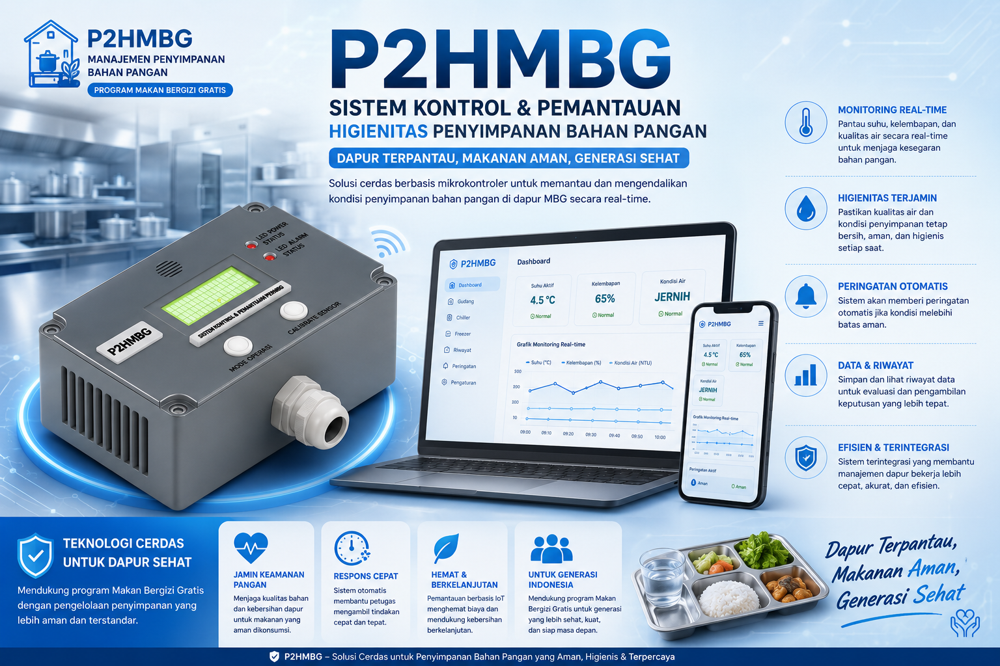
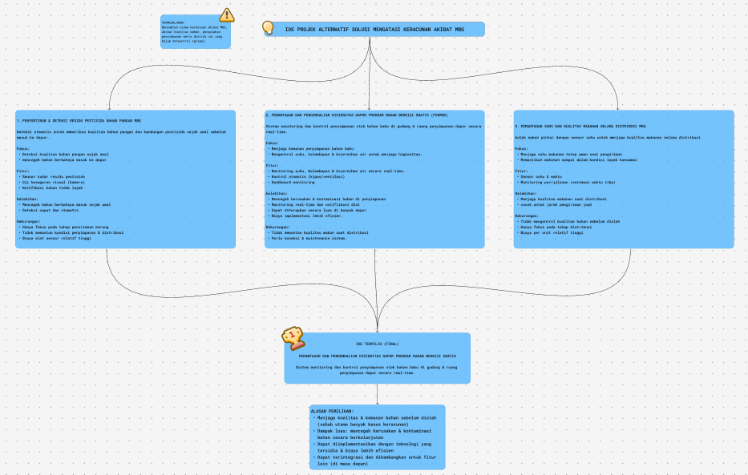
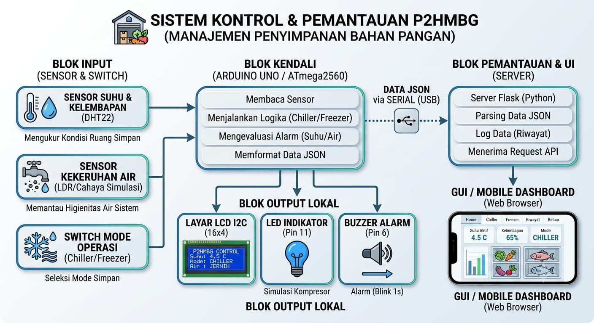
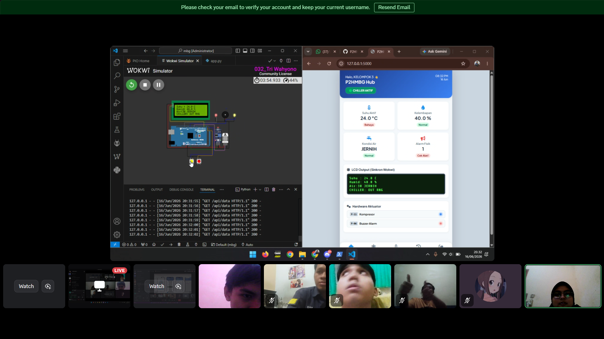
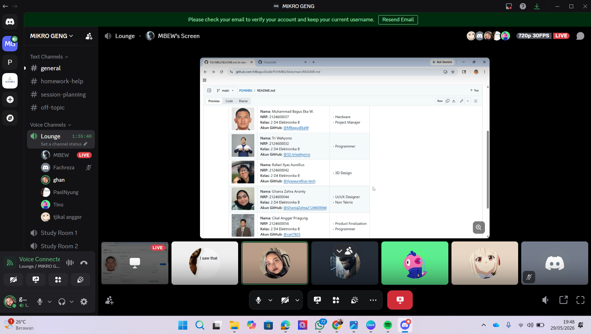

  

<h1 align="center"> P2HMBG</h1>

<h3 align="center">
Pemantauan dan Pengendalian Higienitas pada Dapur Program Makan Bergizi Gratis Berbasis Mikrokontroler
</h3>

---

  

---
<h2 align="center">Tautan Cepat (Quick Links)</h2>

  
  
  
  
  
  
  
  
  

---

## Deskripsi Proyek

**P2HMBG (Pemantauan dan Pengendalian Higienitas Makanan Bergizi Gratis)** merupakan sistem monitoring berbasis mikrokontroler yang dirancang untuk membantu menjaga standar higienitas pada proses penyimpanan dan pengolahan bahan makanan dalam Program Makan Bergizi Gratis (MBG).

Sistem ini melakukan pemantauan terhadap parameter penting yang memengaruhi keamanan pangan, seperti suhu penyimpanan bahan protein, kelembapan area penyimpanan bahan makanan, serta kualitas air yang digunakan untuk proses pencucian. Data yang diperoleh akan digunakan sebagai indikator kondisi higienitas dapur dan gudang penyimpanan.

Melalui integrasi sensor, alarm, dan sistem monitoring, proyek ini mampu memberikan peringatan dini apabila ditemukan kondisi yang berpotensi menyebabkan kerusakan bahan makanan atau kontaminasi. Dengan demikian, proses produksi makanan dapat berjalan lebih aman, higienis, dan sesuai standar keamanan pangan.

---

## Tujuan Proyek

- Mengembangkan sistem monitoring higienitas dapur MBG secara otomatis dan real-time.
- Memantau suhu penyimpanan bahan makanan agar tetap berada pada rentang aman.
- Memantau kelembapan area penyimpanan guna menjaga kualitas bahan makanan.
- Mengawasi kualitas air pencucian bahan makanan melalui sensor kekeruhan.
- Memberikan peringatan dini apabila terjadi kondisi yang berpotensi menyebabkan kontaminasi pangan.
- Membantu proses pencatatan dan dokumentasi kondisi higienitas sebagai pendukung evaluasi dan audit keamanan pangan.
- Mendukung keberhasilan Program Makan Bergizi Gratis melalui penerapan teknologi monitoring yang efektif dan mudah digunakan.

---

## Support By

- Dosen Pengampu: Akhmad Hendriawan, S.T., M.T.
- Mata Kuliah: Mikrokontroler
- Program Studi: D4 Teknik Elektronika
- Politeknik Elektronika Negeri Surabaya (PENS)
  

---

### Anggota Kelompok

| Foto | Informasi Peserta | Peran / Jobdesk |
| :---: | :--- | :--- |
|  | **Nama:** Muhammad Bagus Eka Wijaya **NRP:** 2124600037 **Kelas:** 2 D4 Elektronika B **Akun GitHub:** [@MBagusEkaW](https://github.com/MBagusEkaW)  | - Project Manager  - Hardware |
| | **Nama:** Tri Wahyono **NRP:** 2124600032 **Kelas:** 2 D4 Elektronika B  **Akun GitHub:** [@32-triwahyono](https://github.com/32-triwahyono) | - Programmer |
| | **Nama:** Rafael Ilyas Aurellius **NRP:** 2124600042 **Kelas:** 2 D4 Elektronika B  **Akun GitHub:** [@ilyasaurellius-tech](https://github.com/ilyasaurellius-tech) | - 3D Design|
| | **Nama:** Ghania Zahra Arianty **NRP:** 2124600044 **Kelas:** 2 D4 Elektronika B  **Akun GitHub:** [@GhaniaZahra2124600044](https://github.com/GhaniaZahra2124600044) | - UI/UX Designer - Non Teknis |
| | **Nama:** Cikal Angger Priagung **NRP:** 2124600056 **Kelas:** 2 D4 Elektronika B  **Akun GitHub:** [@carl7825](https://github.com/carl7825) | - Programmer| 
| | **Nama:** Aydin Fachreza Syahmi **NRP:** 2124600048 **Kelas:** 2 D4 Elektronika B  **Akun GitHub:** [@Fchrz10](https://github.com/Fchrz10) | - QA|
---

## Komponen yang Digunakan

- LDR / Sensor Kekeruhan Air
- DHT22
- SW 1 Chiller
- SW 2 Freezer
- LCD I2C 16x4
- Buzzer
- LED / Kompresor

---

# Visualisasi Sistem
## Mindmap Diagram

Mindmap ini menjelaskan proses pemilihan ide proyek P2HMBG berdasarkan permasalahan utama pada Program Makan Bergizi Gratis, yaitu risiko keracunan akibat kualitas bahan, proses pengolahan, penyimpanan, dan distribusi yang belum terkontrol optimal.

  

Dari beberapa alternatif solusi, ide yang dipilih adalah **Pemantauan dan Pengendalian Higienitas Dapur Program Makan Bergizi Gratis (P2HMBG)**. Ide ini dipilih karena berfokus pada monitoring suhu, kelembapan, dan kejernihan air secara real-time untuk menjaga kualitas bahan baku sebelum diolah, dengan biaya implementasi yang lebih efisien dan dapat diterapkan di banyak dapur MBG.

---

## Fishbone Diagram

Fishbone diagram digunakan untuk menganalisis akar permasalahan yang berkaitan dengan higienitas dapur MBG. Diagram ini membantu mengidentifikasi faktor penyebab masalah dari beberapa aspek, seperti manusia, metode, alat, lingkungan, material, dan pengukuran.

  

Berdasarkan analisis fishbone, permasalahan utama yang ingin diselesaikan adalah kurangnya pemantauan otomatis terhadap kondisi higienitas dapur dan penyimpanan bahan makanan. Tanpa sistem pemantauan yang baik, risiko kontaminasi pangan, kerusakan bahan makanan, dan penurunan kualitas makanan dapat meningkat.

---
## Blok Diagram

Blok diagram berikut menjelaskan hubungan antar komponen pada sistem P2HMBG. Sensor berfungsi sebagai input untuk membaca kondisi lingkungan, mikrokontroler memproses data, kemudian hasilnya ditampilkan melalui LCD dan diteruskan ke output berupa LED atau buzzer sebagai indikator kondisi sistem.

  

Sistem terdiri dari tiga bagian utama, yaitu **blok input**, **blok kendali**, dan **blok pemantauan & output**.

### 1. Blok Input
Pada bagian input, sistem menerima data dari beberapa sensor dan switch, yaitu:

- **Sensor Suhu & Kelembapan (DHT22)**  
  Digunakan untuk mengukur kondisi suhu dan kelembapan ruang simpan bahan pangan.

- **Sensor Kekeruhan Air (LDR / Cahaya Simulasi)**  
  Digunakan untuk memantau higienitas air sistem, khususnya untuk mengetahui apakah kondisi air masih jernih atau sudah keruh.

- **Switch Mode Operasi (Chiller / Freezer)**  
  Digunakan untuk memilih mode penyimpanan bahan pangan sesuai kebutuhan, yaitu mode **chiller** atau **freezer**.

### 2. Blok Kendali
Bagian kendali menggunakan **Arduino Uno / ATmega2560** sebagai pusat pemrosesan sistem. Mikrokontroler memiliki beberapa fungsi utama, yaitu:

- Membaca data dari seluruh sensor input.
- Menjalankan logika sistem sesuai mode penyimpanan (**chiller/freezer**).
- Mengevaluasi kondisi alarm berdasarkan parameter suhu dan kualitas air.
- Memformat data hasil pembacaan ke dalam bentuk **JSON**.

Setelah data diproses, mikrokontroler mengirimkan data tersebut ke server melalui komunikasi **serial USB**.

### 3. Blok Output Lokal
Selain mengirimkan data ke server, sistem juga memberikan output lokal secara langsung melalui:

- **Layar LCD I2C 16x4**  
  Menampilkan informasi utama seperti suhu aktif, mode operasi, dan status air.

- **LED Indikator (Pin 11)**  
  Digunakan sebagai indikator visual kondisi sistem, sekaligus sebagai simulasi kompresor.

- **Buzzer Alarm (Pin 6)**  
  Digunakan untuk memberikan peringatan suara apabila terdeteksi kondisi tidak aman, dengan pola alarm berkedip setiap 1 detik.

### 4. Blok Pemantauan & UI
Data yang telah diformat dalam bentuk JSON dikirim ke **server Flask (Python)**. Pada bagian ini, server memiliki fungsi untuk:

- Parsing data JSON
- Menyimpan log data / riwayat
- Menerima request API

Selanjutnya, data ditampilkan pada **GUI / Mobile Dashboard berbasis web browser** sehingga pengguna dapat memantau kondisi sistem secara real-time melalui tampilan antarmuka yang lebih interaktif.

### Alur Kerja Sistem
Secara umum, alur kerja sistem P2HMBG adalah sebagai berikut:

1. Sensor DHT22 membaca suhu dan kelembapan ruang simpan.
2. Sensor kekeruhan air membaca kondisi kejernihan air.
3. Switch menentukan mode operasi, yaitu chiller atau freezer.
4. Arduino memproses seluruh input dan menjalankan logika kontrol sistem.
5. Hasil pembacaan ditampilkan secara lokal melalui LCD.
6. LED dan buzzer aktif sesuai kondisi sistem sebagai indikator dan alarm.
7. Data diformat menjadi JSON dan dikirim ke server Flask melalui serial USB.
8. Server memproses data dan menampilkannya pada dashboard monitoring berbasis web.

Dengan rancangan ini, sistem P2HMBG tidak hanya mampu melakukan pemantauan lokal pada alat, tetapi juga mendukung monitoring digital melalui server dan antarmuka dashboard.

---

## Desain Hardware

Desain hardware P2HMBG dirancang sebagai sistem pemantauan higienitas dapur MBG berbasis mikrokontroler. Sistem ini menggunakan sensor dan aktuator untuk memantau kondisi lingkungan penyimpanan bahan makanan, seperti suhu, kelembapan, dan kualitas air pencucian.

Pada sistem ini, mikrokontroler berperan sebagai pusat kendali yang membaca data dari sensor, menampilkan informasi pada LCD, serta mengaktifkan indikator atau alarm apabila kondisi terdeteksi berada di luar batas aman.

  

  

  

---
## Design UI/UX

UI/UX P2HMBG dirancang untuk memudahkan pengguna dalam memantau kondisi dapur dan penyimpanan bahan makanan. Tampilan aplikasi dibuat sederhana agar pengguna dapat melihat informasi penting seperti kondisi chiller, freezer, riwayat data, dan dashboard monitoring dengan mudah.

### Tampilan Aplikasi P2HMBG

<table>
  <tr>
    <td align="center">
      <b>Login</b> 
      
    </td>
    <td align="center">
      <b>Dashboard</b> 
      
    </td>
  </tr>
  <tr>
    <td align="center">
      <b>Chiller</b> 
      
    </td>
    <td align="center">
      <b>Freezer</b> 
      
    </td>
  </tr>
  <tr>
    <td align="center">
      <b>History</b> 
      
    </td>
  </tr>
</table>

---
## Simulasi Program Wokwi

Simulasi Wokwi digunakan untuk menguji logika kerja sistem P2HMBG sebelum diterapkan pada hardware secara langsung. Melalui simulasi ini, pembacaan sensor, tampilan LCD, input tombol, serta output berupa buzzer dan LED dapat diuji sesuai skenario kondisi higienitas dapur MBG.

  

  

Pada simulasi, beberapa komponen digunakan sebagai representasi dari kondisi nyata di dapur MBG. DHT22 digunakan untuk membaca suhu dan kelembapan, LDR digunakan sebagai simulasi sensor kekeruhan air, switch digunakan sebagai input kondisi chiller dan freezer, sedangkan buzzer serta LED digunakan sebagai indikator peringatan.

---

## Desain 3D

Desain 3D P2HMBG dibuat sebagai visualisasi bentuk fisik alat monitoring higienitas dapur MBG. Rancangan ini menggunakan bentuk box panel yang berfungsi sebagai tempat utama untuk meletakkan komponen elektronik seperti mikrokontroler, LCD, tombol, buzzer, indikator LED, serta jalur konektor sensor.

Pada bagian atas alat terdapat LCD sebagai media tampilan data monitoring, tombol input untuk pengoperasian sistem, serta indikator LED yang menunjukkan status kondisi sistem seperti status chiller, freezer, dan sensor. Bagian sisi box dilengkapi lubang ventilasi untuk membantu sirkulasi udara di dalam casing, sedangkan konektor pada bagian depan digunakan sebagai jalur penghubung sensor atau kabel eksternal.

Desain ini dibuat agar alat terlihat rapi, mudah digunakan, dan sesuai untuk kebutuhan simulasi sistem pemantauan higienitas pada dapur Program Makan Bergizi Gratis.

  

  

  

  

  

---
## Cara Kerja Sistem

Sistem P2HMBG bekerja dengan membaca data dari beberapa input, yaitu sensor suhu dan kelembapan **DHT22**, sensor kekeruhan air berbasis **LDR**, serta switch mode operasi **Chiller/Freezer**.

Data tersebut diproses oleh **Arduino Uno / ATmega2560** untuk menentukan kondisi penyimpanan bahan pangan. Hasil pembacaan ditampilkan pada **LCD I2C 16x4**, sedangkan **LED indikator** digunakan sebagai simulasi kompresor dan **buzzer** digunakan sebagai alarm apabila suhu atau kualitas air berada di luar batas aman.

Selain output lokal, data juga dikirim melalui komunikasi **Serial USB** dalam format **JSON** menuju server **Flask (Python)**. Server kemudian menampilkan data pada dashboard web agar kondisi penyimpanan dapat dipantau secara real-time.

---

# Panduan Penggunaan

1. Hubungkan alat P2HMBG ke sumber daya atau port USB.
2. Pastikan sensor DHT22, LDR, switch, LCD, LED, dan buzzer sudah terpasang dengan benar.
3. Nyalakan sistem dan tunggu proses inisialisasi selesai.
4. Pilih mode penyimpanan menggunakan switch **Chiller** atau **Freezer**.
5. Amati data suhu, kelembapan, mode, dan status air pada LCD.
6. Jika buzzer berbunyi atau LED menyala, periksa kondisi suhu dan kualitas air.
7. Jalankan server Flask untuk menampilkan data pada dashboard web.
8. Buka dashboard melalui web browser untuk memantau data secara real-time.

---

## Dokumentasi 

Berikut adalah beberapa dokumentasi teknis dan pengerjaan proyek P2HMBG:

  
  
  

