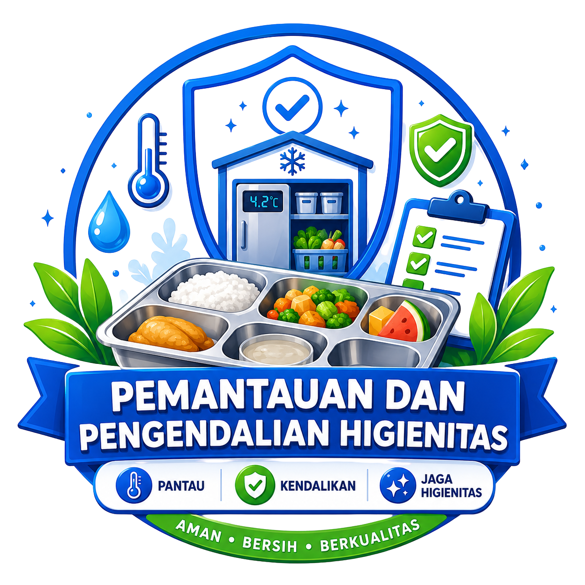

  

<h1 align="center"> P2HMBG</h1>

<h3 align="center">
Pemantauan dan Pengendalian Higienitas pada Dapur Program Makan Bergizi Gratis Berbasis Mikrokontroler
</h3>

---

<h2 align="center">Tautan Cepat (Quick Links)</h2>

  
  
  
  
  
  
  
  

---

## Deskripsi Proyek

**P2HMBG (Pemantauan dan Pengendalian Higienitas Makanan Bergizi Gratis)** merupakan sistem monitoring berbasis mikrokontroler yang dirancang untuk membantu menjaga standar higienitas pada proses penyimpanan dan pengolahan bahan makanan dalam Program Makan Bergizi Gratis (MBG).

Sistem ini melakukan pemantauan terhadap parameter penting yang memengaruhi keamanan pangan, seperti suhu penyimpanan bahan protein, kelembapan area penyimpanan bahan makanan, serta kualitas air yang digunakan untuk proses pencucian. Data yang diperoleh akan digunakan sebagai indikator kondisi higienitas dapur dan gudang penyimpanan.

Melalui integrasi sensor, alarm, dan sistem monitoring, proyek ini mampu memberikan peringatan dini apabila ditemukan kondisi yang berpotensi menyebabkan kerusakan bahan makanan atau kontaminasi. Dengan demikian, proses produksi makanan dapat berjalan lebih aman, higienis, dan sesuai standar keamanan pangan.

---

## Tujuan Proyek

- Mengembangkan sistem monitoring higienitas dapur MBG secara otomatis dan real-time.
- Memantau suhu penyimpanan bahan makanan agar tetap berada pada rentang aman.
- Memantau kelembapan area penyimpanan guna menjaga kualitas bahan makanan.
- Mengawasi kualitas air pencucian bahan makanan melalui sensor kekeruhan.
- Memberikan peringatan dini apabila terjadi kondisi yang berpotensi menyebabkan kontaminasi pangan.
- Membantu proses pencatatan dan dokumentasi kondisi higienitas sebagai pendukung evaluasi dan audit keamanan pangan.
- Mendukung keberhasilan Program Makan Bergizi Gratis melalui penerapan teknologi monitoring yang efektif dan mudah digunakan.

---

## Support By

- Dosen Pengampu: Akhmad Hendriawan, S.T., M.T.
- Mata Kuliah: Mikrokontroler
- Program Studi: D4 Teknik Elektronika
- Politeknik Elektronika Negeri Surabaya (PENS)
  

---

### Anggota Kelompok

| Foto | Informasi Peserta | Peran / Jobdesk |
| :---: | :--- | :--- |
|  | **Nama:** Muhammad Bagus Eka Wijaya **NRP:** 2124600037 **Kelas:** 2 D4 Elektronika B **Akun GitHub:** [@MBagusEkaW](https://github.com/MBagusEkaW)  | - Project Manager  - Hardware |
| | **Nama:** Tri Wahyono **NRP:** 2124600032 **Kelas:** 2 D4 Elektronika B  **Akun GitHub:** [@32-triwahyono](https://github.com/32-triwahyono) | - Programmer |
| | **Nama:** Rafael Ilyas Aurellius **NRP:** 2124600042 **Kelas:** 2 D4 Elektronika B  **Akun GitHub:** [@ilyasaurellius-tech](https://github.com/ilyasaurellius-tech) | - 3D Design|
| | **Nama:** Ghania Zahra Arianty **NRP:** 2124600044 **Kelas:** 2 D4 Elektronika B  **Akun GitHub:** [@GhaniaZahra2124600044](https://github.com/GhaniaZahra2124600044) | - UI/UX Designer - Non Teknis |
| | **Nama:** Cikal Angger Priagung **NRP:** 2124600056 **Kelas:** 2 D4 Elektronika B  **Akun GitHub:** [@carl7825](https://github.com/carl7825) | - Programmer| 
| | **Nama:** Aydin Fachreza Syahmi **NRP:** 2124600048 **Kelas:** 2 D4 Elektronika B  **Akun GitHub:** [@Fchrz10](https://github.com/Fchrz10) | - QA|
---

## Komponen yang Digunakan

- LDR / Sensor Kekeruhan Air
- DHT22
- SW 1 Chiller
- SW 2 Freezer
- LCD I2C 16x4
- Buzzer
- LED / Kompresor

---

## Design UI/UX

### Tampilan Aplikasi P2HMBG

<table>
  <tr>
    <td align="center">
      <b>Login</b> 
      
    </td>
    <td align="center">
      <b>Dashboard</b> 
      
    </td>
  </tr>
  <tr>
    <td align="center">
      <b>Chiller</b> 
      
    </td>
    <td align="center">
      <b>Freezer</b> 
      
    </td>
  </tr>
  <tr>
    <td align="center">
      <b>History</b> 
      
    </td>
  </tr>
</table>

---
